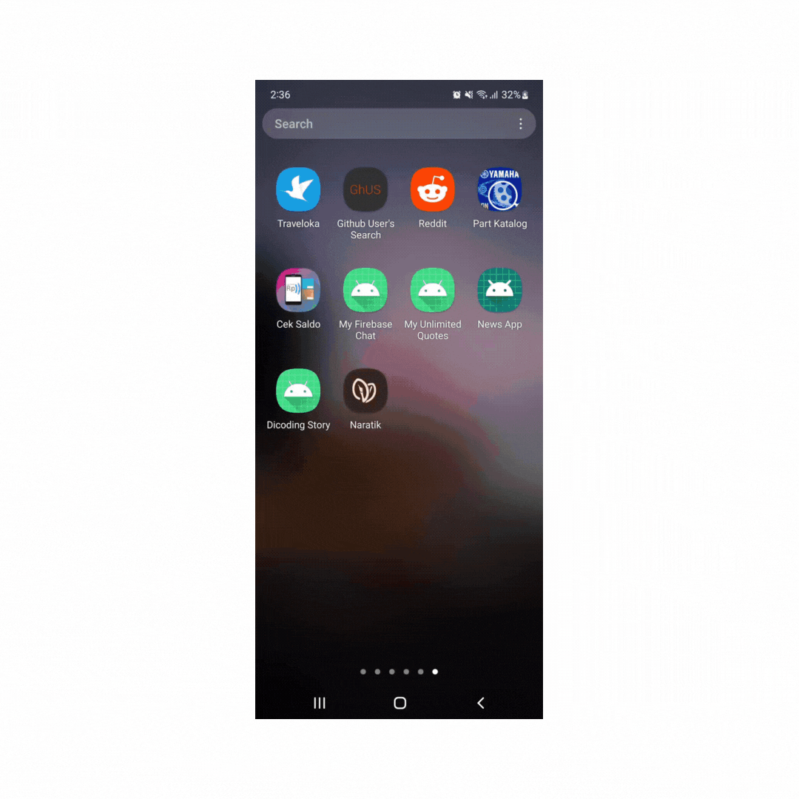

<!-- PROJECT SHIELDS -->
<!--
*** I'm using markdown "reference style" links for readability.
*** Reference links are enclosed in brackets [ ] instead of parentheses ( ).
*** See the bottom of this document for the declaration of the reference variables
*** for contributors-url, forks-url, etc. This is an optional, concise syntax you may use.
*** https://www.markdownguide.org/basic-syntax/#reference-style-links
-->
<!--
[![Contributors][contributors-shield]][contributors-url]
[![Forks][forks-shield]][forks-url]
[![Stargazers][stars-shield]][stars-url]
[![Issues][issues-shield]][issues-url]
[![MIT License][license-shield]][license-url]
[![LinkedIn][linkedin-shield]][linkedin-url]
-->

<!-- PROJECT LOGO -->
 

  

  

    Github User App features an application where we can find any Github user information provided by Github Api
      
    <a href="https://github.com/aditasha/github-user-app/issues">Report Bug</a>
    ·
    <a href="https://github.com/aditasha/github-user-app/issues">Request Feature</a>
  

<!-- ABOUT THE PROJECT -->
## About The Project

  

 

This project was created using Kotlin, utilizing RecylerView, Retrofit and SearchView to show, collect and search data, ViewPager 2 to navigate between followers/following tab, MVVM Architecture, Room to store favorite user and Data Store Preferences to store themes.

### Built With

* [Kotlin](https://kotlinlang.org/)
* [Android Studio](https://developer.android.com/studio)
* [RecyclerView](https://developer.android.com/jetpack/androidx/releases/recyclerview)
* [Retrofit](https://square.github.io/retrofit/)
* [Glide](https://github.com/bumptech/glide)
* [SearchView](https://developer.android.com/reference/android/widget/SearchView)
* [ViewPager2](https://developer.android.com/jetpack/androidx/releases/viewpager2)
* MVVM Architecture
* [Room](https://developer.android.com/jetpack/androidx/releases/room)
* [DataStore](https://developer.android.com/topic/libraries/architecture/datastore)

<!-- CONTACT -->
## Contact

- Aditasha | [Twitter](https://twitter.com/aditashaa) | aditasha9@gmail.com

Project Link: [https://github.com/aditasha/github-user-app](https://github.com/aditasha/github-user-app)

<!-- MARKDOWN LINKS & IMAGES -->
<!-- https://www.markdownguide.org/basic-syntax/#reference-style-links -->
[contributors-shield]: https://img.shields.io/github/contributors/aditasha/coolyeah.svg?style=for-the-badge
[contributors-url]: https://github.com/aditasha/coolyeah/graphs/contributors
[forks-shield]: https://img.shields.io/github/forks/aditasha/coolyeah.svg?style=for-the-badge
[forks-url]: https://github.com/aditasha/coolyeah/network/members
[stars-shield]: https://img.shields.io/github/stars/aditasha/coolyeah.svg?style=for-the-badge
[stars-url]: https://github.com/aditasha/coolyeah/stargazers
[issues-shield]: https://img.shields.io/github/issues/aditasha/coolyeah.svg?style=for-the-badge
[issues-url]: https://github.com/aditasha/coolyeah/issues
[license-shield]: https://img.shields.io/github/license/aditasha/coolyeah.svg?style=for-the-badge
[license-url]: https://github.com/aditasha/coolyeah/blob/master/LICENSE.txt
[linkedin-shield]: https://img.shields.io/badge/-LinkedIn-black.svg?style=for-the-badge&logo=linkedin&colorB=555
[linkedin-url]: https://linkedin.com/in/aditasha
